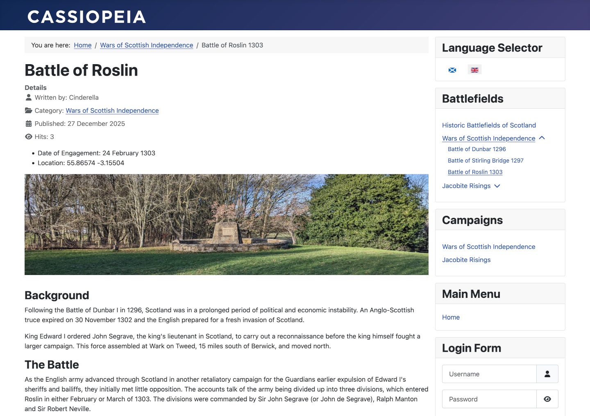

# Demodata Plugins

This folder contains a plugin to install and uninstall demonstration data. There
is a separate module named cefjdemos-mod-demodata required to show the plugins 
in the Administrator Dashboard. The plugin contains data for Scottish
Battlefields in English and Scottish Gaelic. The data is independent of the 
code so can be replaced with almost anything. But beware, data creation is
a time-consuming task.

This plugin is a Work in Progress. Some features need more work, specifically
Banners, Contacts and Workflows.

## Setup

- Install Joomla with English-GB as the default language.
- Install Scottish Gaelic
- Enable Content Languages
- Enable System Language Filter
- Create a Language Switcher module.
- Install the Demonstration Data module
- Install and enable the Demodata plugin.
- In the Home Dashboard select the Demo Data module Install button.

## In Use

The site frontend may look something like the following:

## Notes

- The contents are stored in language specific subfolders (en-gb and gd-gb).
- The languages to use are set in the plugin Options.
- The item specifications are stored in json files, for example articles.json.
- The article contents are stored in html files, for example battle-of-roslin.html
- Images are stored in language specific sub-folders.
- Symbolic links are used to link the site images folder to the plugin folder.

## References

https://en.wikipedia.org/wiki/Inventory_of_Historic_Battlefields_in_Scotland
